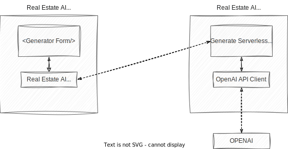

# Real Estate AI - House Description Generator 🏠 🤖

This project generates a description of an house using [OpenAI GPT-3 API](https://openai.com/api/) (`text-davinci-003`) and [Vercel Edge functions](https://vercel.com/features/edge-functions) with streaming. It constructs a prompt based on the form and user input, sends it to the GPT-3 API via a Vercel Edge function, then streams the response back to the application.

## Tech Stack 🛠

- [Next.js](https://nextjs.org/) (React framework)
- [Tailwind CSS](https://tailwindcss.com/) (utility-first CSS framework)
- [Vercel Edge functions](https://vercel.com/features/edge-functions) (streaming support!)
- [OpenAI GPT-3 API](https://openai.com/api/) (`text-davinci-003`)
- [Framer Motion](https://www.framer.com/motion/) (animations)
- [Headless UI](https://headlessui.dev/) (React components using tailwind css)
- [ESLint](https://eslint.org/) (linter)
- [Prettier](https://prettier.io/) (code formatter)
- [Draw.io](https://draw.io/) (for diagrams)
- [React Hot Toast](https://react-hot-toast.com/) (toasts)
- [Zod](https://zod.dev/) (schema validation)
- [React Hook Form](https://react-hook-form.com/) (form management)
- [Heroicons](https://heroicons.com/) (icons)
- Multiple Layouts with [Next.js](https://nextjs.org/docs/basic-features/layouts)
- SEO with [Next.js](https://nextjs.org/docs/api-reference/next/head)

## Architecture 🏗



If you want to see the implementation without streaming, check [this commit](https://github.com/alexmarqs/real-estate-ai-app/commit/810d967354ff583882c66cc169048a164296283b).

## Running locally 🏃‍♂️

Make sure that you have a `.env` file with your OpenAI API key (`OPENAI_API_KEY`)

```bash
yarn dev
```

Open [http://localhost:3000](http://localhost:3000) with your browser to see the result.
